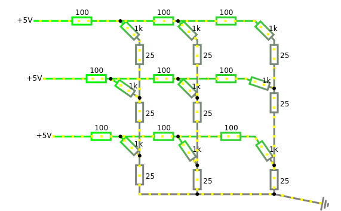

# Memristive crossbar simulator via star-mesh transform (node deletion)
A memristive crossbar is a grid-based hardware architecture composed of memristors. Each memristor stores a programmable conductance value and enables efficient analog matrix-vector multiplication using Ohm’s and Kirchhoff’s laws. This makes memristive crossbars highly suitable for neural network acceleration, neuromorphic computing, and in-memory computing systems. The goal of this project is to develop a C-based simulator that enables fast computation of voltages at the bottom row of crossbar (so that result of matrix-vector multiplication can be obtained by multiplying this node voltage by corresponding conductance between this node and ground).

## Physical structure  

    

Conside **m**x**n** memristive crossbar:
- m horisontal lines (word lines)
- n vertical lines (bit lines)
- at each intersection  a memristor with conductance $G_{ij}$,  
Hence the conductance matrix stored in crossbar is:

$$
G=
\begin{pmatrix}
G_{11} & G_{12} & ... & G_{1n} \\
G_{21} & G_{22} & ... & G_{2n} \\
...\\
G_{m1} & G_{m2} & ... & G_{mn} \\
\end{pmatrix}
$$

On the image these memristors are shown as diagonal resistors of 1 KOhm each.
<!---->

We apply input voltages $V_{in}$ to the word lines on the left to compute  $y=G^Tx$. On the image they are 5V inputs. If bit line is held at ground ('0 V') then current through $ij^{th}$ ($i^{th}$ word line and $j^{th}$ bit line) memristor $I_{ij}=G_{ij}*(V_{ij,wl}-V_{ij,bl})=G_{ij}*V_{ij,wl}$. Here $V_{ij,wl}$ is the voltage at connection of the $i^{th}$ wordline and $ij^{th}$ memristor, and $V_{ij,bl}$ is a voltage at the connection of $j^{th}$ bitline and $ij^{th}$ memristor.  
By Kirchhoff’s Current Law (KCL), For the $j^{th}$ column, and $m^{th}$ (near the ground) word line, the current is the sum of currents from all (previous) wordlines $I_{ij},\ i=1..m$, that flow in this $j^{th}$ biltline node. Hence, in ideal case with zero wire resistances,

$$I_j=\sum_{i=1}^{m} I_{ij}=\sum_{i=1}^{m} G_{ij}*V_{ij,wl};$$

$$I=G^T*V_{in}$$

## Model
For our model we simulate crossbar with parasitic world line (on the image this is horisontal 100Ohm resistors) and bitline conductances (on the image this is vertical 25 Ohm resistors).

## Adjacency matrix and node deletion
The shared library that is writen in C can be used for any graph of conductances (indipendent of graph structure). The recuirement for input, though is to pass columns indexes, row indexes, and values in column major partially ordered format (like Matlab returns after `[row,col,val]=find(G_adj);` call). In our case it is used for crossbars of sizes $m \times n$.
### Adjacency matrix formation
For memristive crossbar with parasitic conductances, one can consider crossbar as graph with $2*m*n$ nodes (2 nodes corresponding to each memristor, one at connection to the word line, one at conncection to the bit line). Nodes then should be numerated. The numeration scheme is in general arbitrary (the point is to be consistent and remember which node number corresponds to which node voltage (node potential)). For our application we numbered nodes from left to right, from word line to bit line (so, for example, word line node at row $i$ and column $j$ is node number $2* n * (i-1)+j$ ), then we counted input voltage nodes (m in total, from top ( $2 * m * n+1$ ) to bottom ( $2* m * n+m$ )), then ground (zero) node was counted ( $2 * m * n+m+1$ ). Then for any conductance $G_{kl}$ between nodes $k$ and $l$, adjacency matrix is populated at row $k$ and column $l$ with value $G_{kl}$, and at row $l$ and column $k$ with value $G_{kl}$. This part is done in Matlab (function `adj_m_w()`). This matrix is sparse for the crossbar. In Matlab it is usually stored in column major order, and rows, columns, and values can be extracted with `[row,col,val]=find(G_adj);` then these arrays can be sent to C routine to represent matrix.  
### Node deletion
Node deltation is performed using star mesh transform [Star-Mesh transformations](http://home.lizzy.com.au/jeremy.staines/Star_Delta_transform.pdf) repeteadely. To delete some node $i$ with $N_i=neib(i)$ neighbours, one has to create subgraph whith $((N_i)*(N_i-1))/2)$ nodes where any two neighbourhouding nodes have coneection (basically full subgraph), if they already have some connection, conductances are summed (by the rule of parrallel conductances). Then graphs are merged. This implies that only nodes that are nonneighbours can be deleted in parallel. Then all subgraphs should be merged together. To speed up computation, parallelism is utilized.  
There are 3 modes for the C implementation:
1. Mode 1. Funciton is `mode1_f`. During this mode graph level parallelism is utilized. The function `node_analyzer()` analyzes graph structure of the adjacency matrix (columns and rows that contain nonzero values) and updates `nds_td` array (of nodes to delete) with nonzero entries for nonneighbours (so these entris are safe to delete in parrallel). Then resulting subgrapsh are merged together, then reult merged with the remaining parts of the original graph. Mode 1 has parameter `th_nb_koef`. This parameter allows to transit to mode 2 earlier, even if there are still some indipendent nodes that potentially could be deleted in mode 1. If this parameter is `1.`, than all graph level parallelizm is utilized (deletion continuous is mode 1 untill all nodes are neighbours). Then mode 2 starts.
2. Mode 2. Funciton is `mode2_f`. During this mode nodes are deleted sequentially, and star-mesh transform operation parallelism (during node deletion calculation of resulting subgraph does not depend on order of neighbour selection) is utilized. After mode 2 all nodes in `nds_td` are deleted. Transition to mode 3 is conditional. If `max_m_sz` (maximum number of nodes that the underlying solver can process (or equivalently the number of equation in the resulting matrix to solve)) is greater of equal to $n$ (the number of columns), further processing is not needed (all node voltages can be solved for in one thread). Howvever, if it is smaller, mode 3 starts.
3. Mode 3. Function is `mode3_f`. This mode reduces the resulting matrix to solve size (for underlying solver), but since all node voltages on the bit lines at $m^{th}$ row are still needs to be calculated, more than one matrix need to be formed. Then number of threads (or, equivalently, number of matrixes to solve) is returned by `n_th` parameter, and is calculated as $\lceil$ n/max_m_sz $\rceil$. To form each matrix, mode 2 is used (since at this point graph had undergo mode 1 and mode 2 before, there is high likelihood that every node is connected, or at lease majority of them, hence, running mode 1 before mode 2 in mode 3, most likely will be ineficient). Mode 2 called from mode 3 reduces grapth further, and keeps in ther resulting matrixes subsets of nodes that need to be solved for. Hence, for underlying solver, these (indipendent) matrixes can be solved in parallel to get corresponding subsets of node values.

# Features
The shared library writen in C is currently developed to support following features: interactive mode and offline mode.
### Interactive mode
Interactive mode is the mode that analyses and processes new input graph and outpus matrixes to the calling routine (for example, Matlab). Then the calling routine can solve matrixes to find node voltages, and then (optionally) use these node voltages to get (corrected for parasitic conductances) result of original matrix vector multiplication.
### Record mode <!-- TODO -->
This mode is designed is designed to prerecord lists for mode 1 and mode 2 to skip the graphs merging parts. This is done by basically mimicing interective mode 1 and mode 2, but ouput is not the matrixes to solve, but lists and merge indexes saved to file. Later calls to mode 1 and mode 2 for this graph can read this data.
### Offline mode
If node deletion should be done for the graph that was previously processed by record mode (say, crossbar of some fixed size), one can provide values of this graph and file name of output of record mode on graph of identicial strucutre (crosbar of same size). That should speed up algorithm by reducing necessity for the merge part.
### Note: batch processing
The caller routine (for exmaple, Matlab) can sovle equations for the same matrixes but different input vectors (righ-hand-sides of equation after transromation of adjacency matrixes to laplacians (for example, by using `adj_to_lapl`) suitable to run solver). For different input vectors one can run functions in shared library to get outpus adjacency matrixes once, and then use these adjacency matrixes for different input vectores.

## Useage and instalation
### Creating shared library
After dowloading repository, one can compile C sources and create corresponding object file by running:  
`gcc -c star_mesh_base_.c -o star_mesh_base.o -fPIC -g -Wall -Wextra -fopenmp`,  
and if that compiles without errors, one can link by runing  
`gcc -o libnode_schr.so star_mesh_base.o -fPIC -shared`  
resultin `libnode_shcr.so` shared library should be generated.
### Library functions
There are several functions that can be called:
#### dense_rdct
Function that does main computation in the intnteractive mode is `dense_rdct`. It isself calls required mode 1, mode 2, and mode 3 functions.The full signuture of `dense_rdct` is: 

    dense_rdct(  
    unsigned int *row, unsigned long long int* rw_v,  
    unsigned int *col, unsigned long long int* cl_v,  
    double *val, unsigned long long int* vl_v, unsigned int *len,  
    unsigned int **ln_,  
    unsigned int *nds_td, unsigned int *nds_n,  
    double th_nb_koef, 
    unsigned int *nds_td1, unsigned int nds_n1,  
    unsigned int* n_th,unsigned int max_m_sz,  
    int mode_dbg, unsigned int num_iter
    )

Here *row, *col, and *val are input adjacency matrix rows, columns indexes (column major, partially ordered), and values at correspoinding rows and columns. These arrays are of length *len. The pointers *rw_v, *cl_v, and *vl_v are basically pointers to ouput arrays (rows, columns, and values) of output matrixes. These are essentially triple pointers, but not all versions of Matlab support triple pointers. So the value sored at these addresses is actually another addres.

<!-- how to compile, how to call (signature, Matlab usage), -->
### Testing
<!--Several branches,
Accuracy testing-->
<!-- up to here -->
#### Nodal analysis
<!--To check for correctness-->
<!--
When including both memristors and a wire loss resistor between each pair of elements on the WLs and BLs, the circuit contains $2 \times m \times n$ voltage nodes. The conductances of the resistors may be stored in a symmetric $2 \times m \times n$ by $2 \times m \times n$ matrix $\boldsymbol{G}$. The currents flowing in each node can be stored in a $2 \times m \times n$ vector $I$ (all but $n$ of which are zero). The vector of $2 \times n \times m$ node voltages, $V$ can be computed by solving the equation $\boldsymbol{G}V=I$. For constructing the matrix, assume the following notation:

\begin{enumerate}
    \item $V_i$: the voltage source at WL $i$,
    \item $D_{(i,j)}$: the memristor that is connected between WL $i$ and BL $j$,
    \item $G_{i,j}$: its conductance of $D_{(i,j)}$,
    \item $G_{BL}$: conductance of bit line (wire resistance),
    \item $G_{WL}$: conductance of word line (wire resistance),
    \item $V_{WL(i,j)}$: the voltage node of the WL-side of the memeristor,
    \item $V_{BL(i,j)}$: voltage node of the BL-side of the memristor,
    \item $I_{D(i,j)}$: current from $V_{BL(i,j)}$ to $V_{WL(i,j)}$,
    \item $I_{WL(i,j)}$: current from $V_{WL(i,j)}$ to $V_{WL(i,j-1)}$, and
    \item $I_{BL(i,j)}$: current from $BL_{i+1,j}$ to $V_{BL(i,j)}$.
\end{enumerate}

These notations are depicted in Fig. \ref{fig:crossbar_notation}, which shows three sections of the crossbar array, the upper left, upper right, and lower right, showing how the nodal equations are computed differently for the first row, first column, last row, and last column.

%\begin{figure}[!t]
%\centering
%\includegraphics[width=2.5in]{figures/crossbar.pdf}
%\caption{Notion used in crossbar matrix.}
%\label{fig:crossbar_notation}
%\end{figure}

Kirchhoff's current law gives the following equations \cite{badcrossbar}:

\begin{equation}
    I_{WL(i,j)}-I_{WL(i,j+1)}-I_{D(i,j)}=0\ for\ j<n \label{eq:FKLForJsN}
\end{equation}

\begin{equation}
    I_{WL(i,j)}-I_{D(i,j)}=0\ for\ j=n \label{eq:FKLForJeqN}
\end{equation}

\begin{equation}
    I_{D(i,j)}-I_{BL(i,j)}=0\ for\ i=1 \label{eq:FKLForIeq1}
\end{equation}

\begin{equation}
    I_{D(i,j)}+I_{BL(i-1,j)}-I_{BL(i,j)}=0\ for\ i>1 \label{eq:FKLForIg1}
\end{equation}

When $j=1$ voltages at WLs are just input voltages:$V_{WL(i,j)}=V_{WL(i,1)}=V_i$ which is also shown in Eq.\ref{eq:current1}.

\begin{multline}
     (V_{WL(i,j)}-V_i)\times G_{WL}=(V_{BL(i,j)}-V_{WL(i,j)})\times G_{(i,j)}+\\+(V_{WL(i,j+1)}-V_{WL(i,j)})\times G_{WL}; \Rightarrow \\V_{WL(i,j)}\times (2\times G_{WL}+G_{(i,j)})+V_{WL(i,j+1)}\times (-G_{WL})+\\+V_{BL(i,j)}\times (-G_{(i,j)})=V_i\times G_{WL};\\for\ 1\leq i \leq m,\ j=1\label{eq:current1}
\end{multline}

%\begin{equation}
%    \label{eq:current1}
 %   (2 G_{WL} + G_{(i,1)})V_{WL(i,1)} - %G_{WL}V_{WL(i,2)} - G_{(i,1)}V_{BL(i,1)} %= G_{WL}V_i
%\end{equation}

Nodes corresponding to internal columns ($1<j<n$) and internal rows ($1<i<m$) can be computed as in Eqs. \ref{eq:current2} and \ref{eq:current3}. Other equations for node voltages can be derived similarly.

\begin{multline}
     (V_{WL(i,j)}-V_{WL(i,j-1)})\times G_{WL}=(V_{BL(i,j)}-V_{WL(i,j)})\times \\ \times G_{(i,j)}+(V_{WL(i,j+1)}-V_{WL(i,j)})\times G_{WL}; \Rightarrow \\V_{WL(i,j)}\times (2\times G_{WL}+G_{(i,j)})+V_{WL(i,j-1)}\times (-G_{WL})+\\+V_{WL(i,j+1)}\times (-G_{WL})+V_{BL(i,j)}\times s(-G_{D(i,j)})=0;\\for\ 1<i<m,\ 1<j<n\label{eq:current2}
\end{multline}

\begin{multline}
     (V_{BL(i,j)}-V_{WL(i,j)})\times G_{(i,j)}+(V_{BL(i,j)}- V_{BL(i-1,j)})\times G_{BL}=\\=(V_{BL(i+1,j)}-V_{BL(i,j)})\times G_{BL}; \Rightarrow\\
     V_{BL(i,j)}\times (2\times G_{BL}+G_{(i,j)})+V_{BL(i+1,j)}\times (-G_{BL})+\\+V_{BL(i-1,j)}\times (-G_{BL})+V_{WL(i,j)}\times (-G_{(i,j)});\\ for\ 1<i<m,\ 1<j<m\label{eq:current3}
\end{multline}

-->

## Note1: Limited Conductance Dynamic Range
Real devices have their dynamic ranges (different for different technologies). When mapping weight to real crossbar, scalling is recommended. However, our model accept any positive floating point numbers for memristor conductances, word line conductances, and bit line conductances.

## Model limitations
There are real world limitations that our current model do not address.

<!-- TODO dig -->
### Sneak path currents
In passive crossbars (no selector device), current can flow through unintended paths. For real life hardware implementations, these can be mitigated by:
- adding selector device
- using read//write schemes limiting sneak cureents
### Device nonlinearity
We assume that memrisotr behaves like linear resitor, in real hardware, memristors can follow polynomial or exponential behaviour that are functions of applied voltage. Matematically that can be mitigated in several ways:
- iteratively approximate nonlinear behavour with linear (simpler, but requires multiple runs, may diverge if step is too big)
- solve system of nonlinear equations (similar to previous, but focus on solving original system, rather then iteration through transformation, might be more stable, but usually requires initial guess)
- apply modified star-mesh alghorithm for node reduction for the case on nonlinear resistors (potential future work).
### Device variabily and programming inacuracy
Memristors are stochastic devices. Two identical programming pulses produce slightly different conductances.  
There are device-to-device variation, cycle-to-cycle variation, and temporal drift (conducatance changes over time).  
These can be treated as system noise if physical memristive technology allows.  
Setting conductance (programming) requires iterative pulses.
Closed-loop programming:
- Apply pulse
- Read conductance
- Adjust pulse
- Repeat  
This proces still yields error.
### Noise and thermal effects
These are system nose:
- thermal nose
- shot noise
- random telegraph noise
- amplifier noise
Also high current increases temperature which may lead to drift (in real system cooling mechanism may be implememted)
### Parasitic Capacitance
Crossbar has line capacitance, device capacitance. This introduces RC delay, which limits bandwidth. So large arrays become slow.  
However, in our model we aim to achieve high speed of computation without sacrifycing accuracy. We are not modeling any timing characteristic of real crossbar, only calculationg result of its operation.
### ADC/DAC Quantization Error
ADC and DAC introduce quantization errors, but for our model we focus on crossbar only, and conversions between analog and digital signals are somewhat out of scope, also can be modeled in future works.
